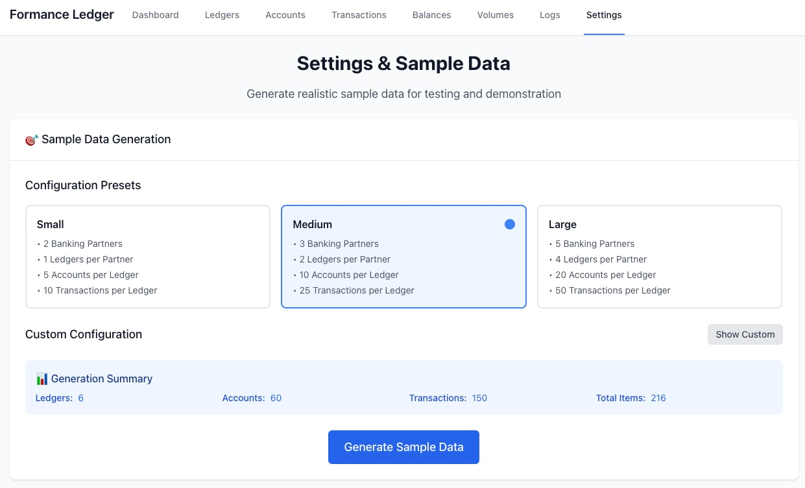

# Formance Ledger UI

A React-based web application for managing Formance Ledger v2 API operations. This application is intended for demo purposes, for creating and managing ledgers, accounts, transactions, balances, volumes, and logs. This application is not intended for production usage.



## 🏗️ What This Application Does

**Formance Ledger UI** is a comprehensive dashboard for managing financial ledgers and transactions. It provides:

- **📊 Dashboard Overview** - Central hub with quick access to all features
- **🏦 Ledger Management** - Create, view, and manage different ledgers
- **👤 Account Management** - View and manage accounts within ledgers
- **💸 Transaction Management** - Create and track money movements between accounts
- **💰 Balance Tracking** - Monitor account balances across different assets
- **📈 Volume Analytics** - Track input/output volumes for accounts
- **📝 Log Management** - View transaction logs and system events
- **⚙️ Settings & Configuration** - Generate sample data and configure environment

## 🚀 Features

- **Modern React 18** with TypeScript
- **Responsive Design** using Tailwind CSS
- **Real-time Data** with React Query
- **Comprehensive Testing** with Jest and React Testing Library
- **API Integration** with Formance Ledger v2 API
- **Sample Data Generation** for testing and development
- **Clean Architecture** with organized components and hooks

## 🛠️ Tech Stack

- **Frontend**: React 18, TypeScript, Vite
- **Styling**: Tailwind CSS
- **State Management**: React Query (TanStack Query)
- **Routing**: React Router DOM
- **Forms**: React Hook Form with Zod validation
- **Charts**: Chart.js with react-chartjs-2
- **Testing**: Jest, React Testing Library
- **Build Tool**: Vite

## 📋 Prerequisites

- Node.js (v16 or higher)
- npm or yarn package manager
- Formance Ledger v2 API running (optional, for full functionality)

## 🚀 Getting Started

### 1. Clone the Repository

```bash
git clone <repository-url>
cd LedgerUI
```

### 2. Install Dependencies

```bash
npm install
```

### 3. Start Development Server

```bash
npm run dev
```

The application will be available at `http://localhost:3000`

### 4. Build for Production

```bash
npm run build
```

### 5. Preview Production Build

```bash
npm run preview
```

## 🧪 Testing

### Run All Tests
```bash
npm test
```

### Run Tests in Watch Mode
```bash
npm run test:watch
```

### Generate Test Coverage
```bash
npm run test:coverage
```

### Open Coverage Report
```bash
npm run test:coverage:open
```

### Development with Live Coverage
```bash
npm run dev:with-coverage
```

## 📁 Project Structure

```
src/
├── components/          # Reusable UI components
│   ├── common/         # Layout, navigation, and shared components
│   ├── dashboard/      # Dashboard-specific components
│   ├── ledger/         # Ledger management components
│   └── transaction/    # Transaction management components
├── hooks/              # Custom React hooks
├── pages/              # Page components for routing
├── services/           # API services and data management
├── types/              # TypeScript type definitions
├── utils/              # Utility functions
└── assets/             # Styles and static assets
```

## 🔧 Configuration

The application is configured to proxy API requests to `http://localhost:3001` by default. You can modify this in `vite.config.ts`:

```typescript
server: {
  proxy: {
    '/api': {
      target: 'http://localhost:3001', // Change this to your API endpoint
      changeOrigin: true,
      rewrite: (path) => path.replace(/^\/api/, ''),
    },
  },
}
```

## 📱 Available Scripts

- `npm run dev` - Start development server
- `npm run build` - Build for production
- `npm run preview` - Preview production build
- `npm run lint` - Run ESLint
- `npm test` - Run tests
- `npm run test:watch` - Run tests in watch mode
- `npm run test:coverage` - Generate test coverage
- `npm run dev:with-coverage` - Development with live coverage

## 🌐 API Integration

This application integrates with the Formance Ledger v2 API, providing:

- **Ledger Operations**: Create, read, update ledgers
- **Account Management**: View account details and balances
- **Transaction Processing**: Create and track financial transactions
- **Balance Monitoring**: Real-time balance tracking across assets
- **Volume Analytics**: Input/output volume tracking
- **Log Management**: Comprehensive transaction logging

## 🤝 Contributing

1. Fork the repository
2. Create a feature branch (`git checkout -b feature/amazing-feature`)
3. Commit your changes (`git commit -m 'Add some amazing feature'`)
4. Push to the branch (`git push origin feature/amazing-feature`)
5. Open a Pull Request

## 📄 License

This project is licensed under the MIT License - see the [LICENSE](LICENSE) file for details.

## 🆘 Support

If you encounter any issues or have questions:

1. Check the existing issues in the repository
2. Create a new issue with detailed information
3. Ensure you're using the latest version of the application

## 🔮 Future Enhancements

- Enhanced charting and analytics
- Real-time notifications
- Advanced filtering and search
- Export functionality
- Multi-tenant support
- Mobile application
